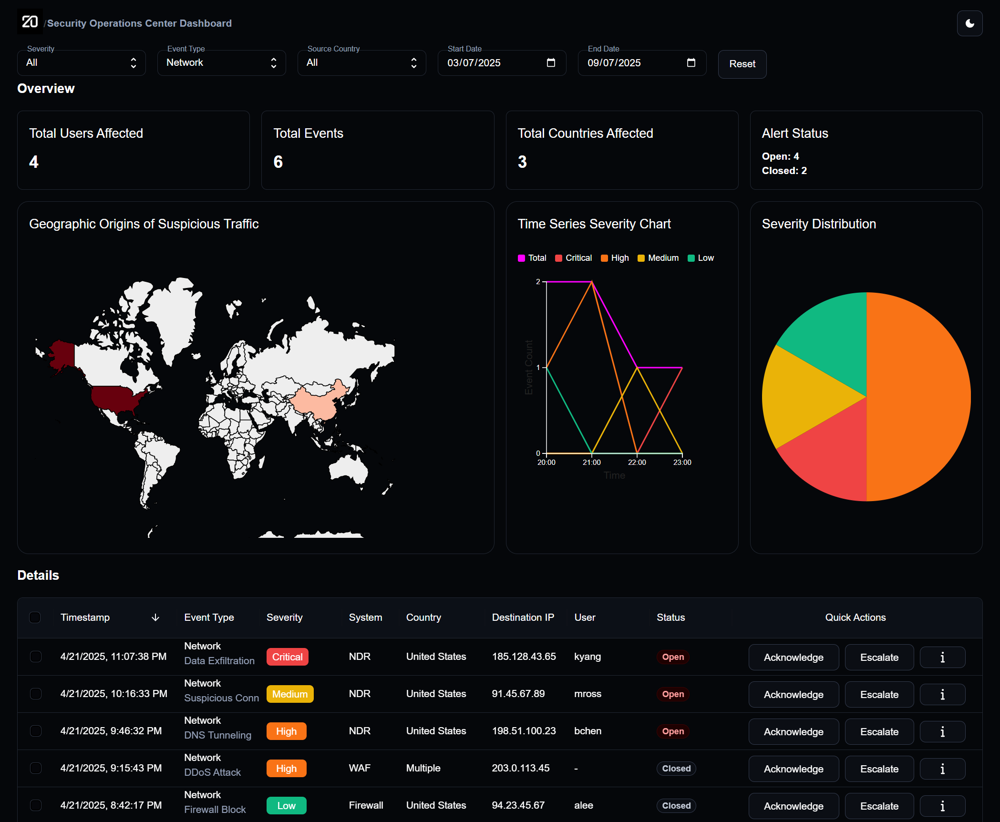

# Twenty-SOC

A modern Security Operations Center (SOC) dashboard built with React, MUI, D3, and Apollo GraphQL.

## Preview



> To see a live demo, run the app locally with `npm start` and open [http://localhost:3000](http://localhost:3000) in your browser.

## Features

- Interactive dashboard with stat blocks, charts, and maps
- Data table with quick actions and filtering
- Responsive layout and modern UI
- Unit tests for utilities and components

## Getting Started

### Frontend Setup

Install dependencies:

```bash
npm install
```

Run the app:

```bash
npm start
```

Run frontend tests:

```bash
npm test
```

### Backend Setup (FastAPI)

1. Install Python dependencies:

```bash
pip install -r backend/requirements.txt
```

2. Run the FastAPI backend:

```bash
uvicorn backend.main:app --reload
```

3. Run backend tests:

```bash
pytest backend/test_main.py
```

#### API Endpoints

- `GET /events` - List events
- `POST /events` - Add a new event
- `GET /events/count` - Get total event count

The backend uses SQLite (`events.db`) for local development. The database file is excluded from git.

## Project Structure

```
src/
  components/      # React components (Dashboard, DataTable, etc.)
  assets/          # Static assets and mock data
  utils.ts         # Utility functions
  theme/           # Theme configuration
  __tests__/       # Test files (or alongside components)
```

## Technologies

- React
- Material-UI (MUI)
- D3.js
- Apollo Client (GraphQL)
- Jest + React Testing Library

## Contributing

Pull requests are welcome! For major changes, please open an issue first to discuss what you would like to change.

## License

MIT

# Getting Started with Create React App

This project was bootstrapped with [Create React App](https://github.com/facebook/create-react-app).

## Available Scripts

In the project directory, you can run:

### `npm start`

Runs the app in the development mode.\
Open [http://localhost:3000](http://localhost:3000) to view it in the browser.

The page will reload if you make edits.\
You will also see any lint errors in the console.

### `npm test`

Launches the test runner in the interactive watch mode.\
See the section about [running tests](https://facebook.github.io/create-react-app/docs/running-tests) for more information.

### `npm run build`

Builds the app for production to the `build` folder.\
It correctly bundles React in production mode and optimizes the build for the best performance.

The build is minified and the filenames include the hashes.\
Your app is ready to be deployed!

See the section about [deployment](https://facebook.github.io/create-react-app/docs/deployment) for more information.

### `npm run eject`

**Note: this is a one-way operation. Once you `eject`, you can’t go back!**

If you aren’t satisfied with the build tool and configuration choices, you can `eject` at any time. This command will remove the single build dependency from your project.

Instead, it will copy all the configuration files and the transitive dependencies (webpack, Babel, ESLint, etc) right into your project so you have full control over them. All of the commands except `eject` will still work, but they will point to the copied scripts so you can tweak them. At this point you’re on your own.

You don’t have to ever use `eject`. The curated feature set is suitable for small and middle deployments, and you shouldn’t feel obligated to use this feature. However we understand that this tool wouldn’t be useful if you couldn’t customize it when you are ready for it.

## Learn More

You can learn more in the [Create React App documentation](https://facebook.github.io/create-react-app/docs/getting-started).

To learn React, check out the [React documentation](https://reactjs.org/).
